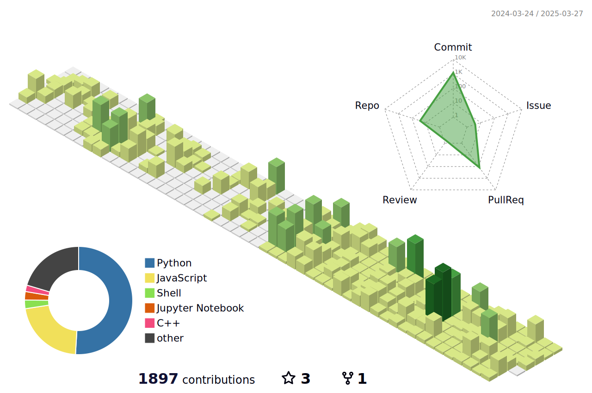

<!---->

  

<h1 align="center">Hi, I'm Sungjin 👋</h1>
<h3 align="center">A passionate Uni Student from S.Korea</h3>
  

<table>
      <tr>
            <td align="center" width="60%"></td>
            <td align="center" width="40%"></td>
      </tr>
      <tr>
            <td align="center"></td>
            <td align="center">
                  

                  

                  

                  

            </td>
      </tr>
      <tr>
            <td>
            <td align="center">
            </td>
      </tr>
</table>

<!---->

<!--
### Top Repositories:

-->

<!---->

<!---->
